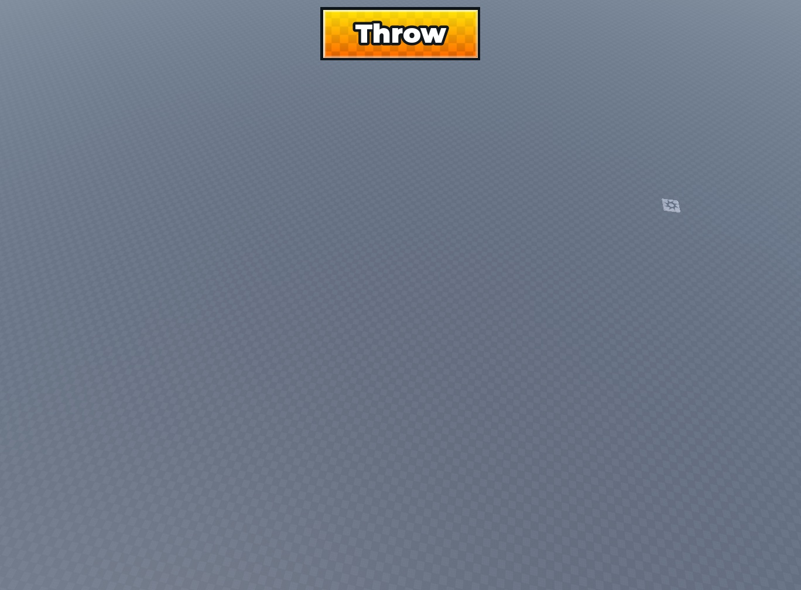

# Check-UI CLEAN ROBLOX SKILL

[](https://roblox.com)
[]()
[]()
[]()
[]()
[]()

> **The definitive design system, component framework, and agentic AI skill for creating modern cartoon and simulator game interfaces in Roblox Studio.**  
> Grounded in the 5 canonical simulator menu archetypes: Shop, Codes, Rebirth, Settings, and Daily Rewards.

---

## 🎨 Visual Showcase (The 5 Canonical Simulator Menus)


Check-UI formalizes the mathematical specifications of the top-grossing Roblox games (*Pet Simulator 99*, *Blade Ball*, *Anime Champions*):

| Menu Archetype | Dimensions | Header Palette | Signature Features |
|:---|:---|:---|:---|
| **1. Shop** | `600 x 415` | Magenta / Crimson (`#FF1496` -> `#E10019`) | `~Gamepass~` & `~Products~` sections, rotating sunbursts, Robux hexagon buy buttons |
| **2. Codes** | `528 x 262` | Electric Cyan (`#00CDFF` -> `#0082F5`) | Recessed input box with highlight border, 3D lime "Redeem" button |
| **3. Rebirth** | `528 x 430` | Royal Purple (`#A000FF` -> `#6000C8`) | Golden "Skip" header button, Tier comparison flow (`➡`), Orange-to-Gold progression bar |
| **4. Settings** | `528 x 415` | Metallic Silver (`#FFFFFF` -> `#D7DEE8`) | Recessed setting rows, Lime green "SFX On" toggle, Hot pink "Music On" toggle |
| **5. Daily Rewards** | `640 x 440` | Lime Neon Green (`#98FF00` -> `#50D000`)| 3x2 Grid (Days 1-6), Full-height Day 7 RAINBOW card, Button State Triad |

---

## 🌟 Why Check-UI?

Too many Roblox UIs suffer from **"AI Slop"** — washed-out semi-transparent rectangles, stretched icons, harsh texture cutoffs, generic non-tactile flat buttons, and zero responsiveness on mobile devices.

**Check-UI solves this forever** by standardizing:
1. **Physical 3D Depth**: Every button features a 3px to 4px bottom extrusion bevel with dark shadow borders.
2. **Signature 3D Close Button `[X]`**: Exact 38x38px square with dark burgundy base (`#730010`), shifted crimson face, pastel highlight stroke, and centered micro-interaction.
3. **2-Tier 3D Header Shadow**: Upper 3px dark thematic accent line + lower 3px pure black line.
4. **Button State Triad**:
   - `CLAIM` / `BUY` / `REDEEM`: Lime Green gradient (`#B4FF19` -> `#69E100`) with dark green bevel.
   - `CLAIMED` / `DISABLED`: Metallic Silver/Grey gradient (`#D8DEE4` -> `#94A0B0`) with dark slate bevel.
   - `LOCKED`: Crimson Red gradient (`#FF2050` -> `#D00020`) with dark burgundy bevel.
   - `SKIP`: Golden Amber gradient (`#FFD000` -> `#FF8C00`) with dark orange bevel.
5. **Seamless Damier (Checkerboard) Fade**: Full-height texture overlay with a smooth 4-point vertical transparency gradient.
6. **Universal Multi-Device Scaling Engine**: Adapts dynamically across phone screens (0.52x), tablets, and high-DPI desktop screens (1.18x) based on `camera.ViewportSize`.
7. **Continuous Rotating Sunbursts**: Smooth 20°/sec rotation behind items, automatically pausing when menus are hidden.
8. **Center-Anchored Animations**: ALL hover, click, and press tweens originate from the exact geometric center via `AnchorPoint = Vector2.new(0.5, 0.5)` + child `UIScale`.
9. **CheckUIIcons Registry**: 1,022 production-grade HD icons (256px) pre-uploaded to Roblox as `rbxassetid://` assets.

---

## 📦 What's Included

```
Check-UI-Clean-Roblox/
├── SKILL.md                 # Agentic AI Skill (usable by Antigravity, Claude, ChatGPT, Cursor)
├── DESIGN_SYSTEM.md         # Exhaustive design manual & mathematical specifications
├── README.md                # Project documentation & visual showcase
├── assets/                  # High-resolution showcase panoramas and comparison renders
│   ├── all_menus_harmonized.png
│   ├── shop_compact_comparison.png
│   └── standard_button_studio.png
├── src/                     # Production-ready Luau modules
│   ├── CheckUITheme.luau       # Design tokens, color palettes, and asset IDs
│   ├── CheckUIComponents.luau  # Builders for Windows, Headers, 3D Buttons, Progress Bars, Cards
│   ├── CheckUIController.luau  # Client controller: scaling, pop tweens, micro-interactions
│   └── CheckUIIcons.luau       # 1,022 HD icon registry (256px) with real rbxassetids
└── examples/                # Complete, standalone menu scripts
    ├── StandardButtonExample.luau   # Canonical iconless button showcase (Studio-verified)
    ├── ShopMenuExample.luau         # Compact 600x415 Shop with Gamepasses & Products
    ├── SettingsMenuExample.luau     # 528x415 Settings with 3D SFX & Music toggles
    ├── CodesMenuExample.luau        # 528x262 Codes with input box & 3D Redeem button
    ├── RebirthMenuExample.luau      # 528x430 Rebirth with Skip button & progression bar
    ├── DailyRewardsMenuExample.luau # 640x440 Daily Rewards with 3x2 grid & Day 7 Rainbow card
    └── HarmonizedMenusExample.luau  # All menus coordinated in a single test environment
```

---

## 🚀 Quick Start

### 1. Using as an AI Skill (Antigravity / Coding Agents)
Copy `SKILL.md` into your agent's skills directory:
```
~/.gemini/antigravity/builtin/skills/check-ui-clean-roblox/SKILL.md
# or inside your workspace:
.agents/skills/check-ui-clean-roblox/SKILL.md
```
Whenever you ask your AI: *"Create a Rebirth menu for my simulator"* or *"Build a 7-day Daily Rewards UI"*, the agent will automatically adhere to the Check-UI design system.

### 2. Manual Roblox Studio Usage
1. Place the `src/` modules inside `ReplicatedStorage.CheckUI`.
2. In a `LocalScript` inside `StarterGui`:

```lua
local ReplicatedStorage = game:GetService("ReplicatedStorage")
local CheckUI = require(ReplicatedStorage.CheckUI.CheckUIComponents)
local Theme = require(ReplicatedStorage.CheckUI.CheckUITheme)
local Icons = require(ReplicatedStorage.CheckUI.CheckUIIcons)

-- Create a Rebirth Window
local rebirthWindow = CheckUI.createWindow({
    Name = "RebirthFrame",
    Size = UDim2.new(0, 528, 0, 430),
    Parent = script.Parent
})

-- Create Royal Purple Header with "Skip" button and [X] Close button
local header = CheckUI.createHeader(rebirthWindow, "Rebirth", Theme.HeaderThemes.Rebirth)
local skipBtn = CheckUI.createHeaderButton(header, "Skip")

-- Create Comparison Flow
local flow = CheckUI.createComparisonFlow({
    Size = UDim2.new(0.92, 0, 0, 56),
    Position = UDim2.new(0.5, 0, 0, 96),
    Parent = rebirthWindow,
    LeftTitle = "Rebirth 1",
    LeftValue = "X1 Money",
    RightTitle = "Rebirth 2",
    RightValue = "X1.3 Money",
})
```

---

## 🔘 Canonical Standard Iconless Button (Studio-Verified)



> **MANDATORY RULE**: Whenever a button **without an icon** is requested (e.g. Throw, Action, Jump, Redeem, Confirm, OK), it **must always follow this exact architecture**:

1. **Crisp Geometric Geometry**: Sharp 90-degree corners (no `UICorner`).
2. **Thick Outer Border**: `3px` solid `#0C141A` dark charcoal border (`ApplyStrokeMode.Border`).
3. **90° Linear Gradient**: Saturated top highlight to deeper bottom shade.
4. **Black Checkerboard Layer**: Subtle tile overlay with a vertical transparency gradient (`0.91 -> 0.62`).
5. **Triple Glass Specular Inner Highlight**: 3 nested frames (`InnerHighlight1`, `2`, `3`) with `1px` white border strokes at `25%`, `45%`, and `80%` transparency creating a soft, anti-aliased Fresnel reflection glow.
6. **GothamBlack Typography**: White `#FFFFFF` centered label with an optical `1px` upward offset and `3px` solid `#11171A` stroke.
7. **Center-Anchored Tween Engine**: Tactile 4-state micro-interactions via `UIScale` (`1.06` hover, `0.94` click).

```lua
local CheckUI = require(ReplicatedStorage.CheckUI.CheckUIComponents)
local Theme = require(ReplicatedStorage.CheckUI.CheckUITheme)

local throwBtn = CheckUI.createStandardButton({
    Name = "ThrowButton",
    Size = UDim2.new(0, 176, 0, 55),
    Position = UDim2.new(0.5, 0, 0.8, 0),
    Text = "Throw",
    Gradient = Theme.ButtonGradients.YellowOrange,
    Parent = screenGui,
})
```

---

## 🎨 Icon Registry (1,022 HD Icons)

Check-UI includes a **complete icon registry** with 1,022 production-ready 256px HD icons across 10 categories:

| Category | Icons | Subcategories |
|:---|:---|:---|
| 🐾 Animal | 12 | Bunny, Cat, Dog |
| 💰 Currency | 110 | Cash, Coin, Crystal, Diamond, Ingot, Premium, Robux, Ticket |
| ⭐ Exclusive | 32 | Angel Heart, Aura, Trail, VIP, + 4 more |
| 🍔 Food | 48 | Avocado, Burger, Cookie, Pizza, + 5 more |
| 🛠️ Item | 326 | Sword, Crown, Shield, Key, Trophy, + 33 more |
| 🏠 Main | 236 | Settings, Codes, Music, Sound, Star, + 22 more |
| 🌿 Nature | 86 | Apple, Cloud, Clover, Planet, + 7 more |
| 👤 Player | 74 | Player, Friend, Skull, + 6 more |
| 💬 Social | 24 | Discord, Twitter, X, Guilded |
| 🖱️ UI | 74 | Checkmark, Close, Plus, Warning, + 9 more |

```lua
local Icons = require(game.ReplicatedStorage.CheckUI.CheckUIIcons)
local coin = Icons.Currency.Coin.Golden_Coin_1st  -- "rbxassetid://..."
local results = Icons.Search("sword")            -- fuzzy search
```

---

## 📐 Color Palette Reference

| Token | Hex | RGB | Usage |
|:---|:---|:---|:---|
| **Canvas Base** | `#3B5866` | `59, 88, 102` | Solid slate blue modal canvas |
| **Canvas Stroke** | `#181E22` | `24, 30, 34` | 3.5px outer window outline |
| **Card Recessed** | `#1A2C34` | `26, 44, 52` | Recessed dark container background |
| **Requirements Box** | `#14222A` | `20, 34, 42` | Sub-container for progression / quests |
| **Close Base (3D)**| `#730010` | `115, 0, 16` | Burgundy 3D bevel extrusion for `[X]` |
| **Claim Green** | `#0F780F` | `15, 120, 15` | 3px bottom 3D bevel on Buy / Redeem / Claim |
| **Claimed Slate** | `#485260` | `72, 82, 96` | 3px bottom bevel on Claimed / Disabled |
| **Locked Burgundy**| `#700010`| `112, 0, 16` | 3px bottom bevel on Locked buttons |
| **Skip Amber** | `#994C00` | `153, 76, 0` | 3px bottom bevel on Skip header button |
| **Music Pink** | `#780A2D` | `120, 10, 45` | 3px bottom 3D bevel on Music On |

---

## 📄 License

Distributed under the **MIT License**. Free to use, adapt, and distribute in any personal or commercial Roblox experience.
